# Yojak · योजक

### Skill, job and workforce intelligence for India


**Understand your fit. Choose what to learn. See the evidence.**

Built for **Build for Bharat 2.0: Intelligent Talent and Workforce Ecosystem**, Yojak connects Indian job-posting data with the ESCO skills taxonomy. It helps students explore roles, recruiters compare skill profiles, institutions assess curricula, and workforce planners inspect regional demand.

Its central question is practical: **given the skills someone already has, which additional skills make more postings reachable?** Answers include the matching skills, remaining gaps, salary ranges, and the assumptions behind each result.

[Public demo](https://yojak01.vercel.app/) · [Screenshots](#product-screenshots) · [Get started](#getting-started) · [Architecture](#architecture) · [Results](#measured-results) · [Benchmarks](#benchmark-design) · [API](#api-reference)

> **Project status:** the code includes four stakeholder workflows, an ESCO explorer, admin tools, and an evidence view. Data-quality, salary, and workforce reports are available. Graph-model comparison, upskilling evaluation, multilingual evaluation, and impact reports are pending in the current report set. The dataset is a historical posting snapshot, not a live jobs feed.

---

## Project at a glance

| Scope | Implemented foundation |
|---|---|
| Problem | Translate skills into explainable career, hiring, curriculum, and workforce decisions |
| Stakeholders | Students/professionals, recruiters, educational institutions, workforce planners |
| Data foundation | Historical Naukri postings, ESCO taxonomy, GeoNames, AISHE and PLFS reference data |
| Analytical approach | Sparse retrieval, semantic linking, coverage optimization, calibrated salary quantiles, demand/supply proxies |
| Delivery | Next.js workspaces, FastAPI services, Neo4j graph, offline artifacts, exported hosted-demo snapshots |
| Evidence available | Data-quality, salary, and workforce reports; generated documentation checked by CI |
| Evidence not yet available | Graph-model winner, gold linking accuracy, multilingual accuracy, planning benchmark and measured user impact |

**Measured snapshot, not live counters:** 97,929 raw postings; 95,151 postings with linked skills; 4,364 distinct linked ESCO skills. Salary evaluation uses 4,953 held-out disclosed-salary postings. See [measured results](#measured-results) for sources and qualifications.

### Presentation route

1. **Frame the decision:** a skill list should lead to a defensible next action, not just a dashboard.
2. **Show the common vocabulary:** inspect the interactive `/network` skill graph, then explain how ESCO connects profiles and postings.
3. **Follow a student journey:** select the Tier-3 fresher example, inspect matched/missing skills, and compare its saved learning plan with frequency advice.
4. **Change stakeholders:** open the recruiter example, curriculum coverage, and workforce map to show reuse of the same data foundation.
5. **Finish with evidence:** show the salary baseline comparison, data coverage, and explicit pending evaluations. Example outputs demonstrate functionality, not validated real-world impact.

## Product screenshots

These are actual captures of the local production frontend in light-theme hosted-demo mode, not design mockups. They document the local implementation and do not assert that the public deployment already contains these changes. Node positions vary as the network rotates.

### Desktop overview

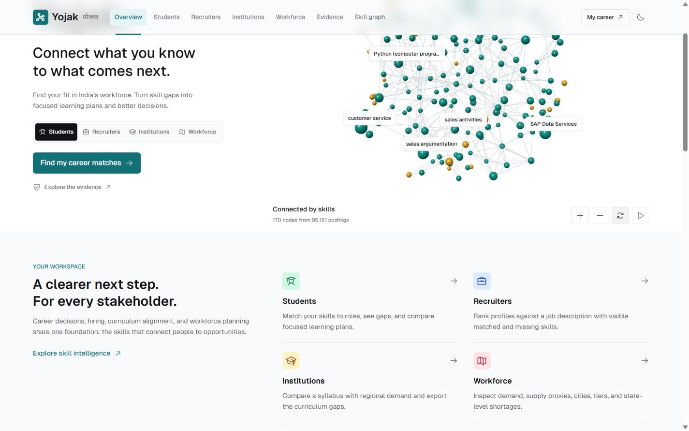

*Overview, scrolled to the stakeholder entry points and data-backed network.*

### Interactive skill graph

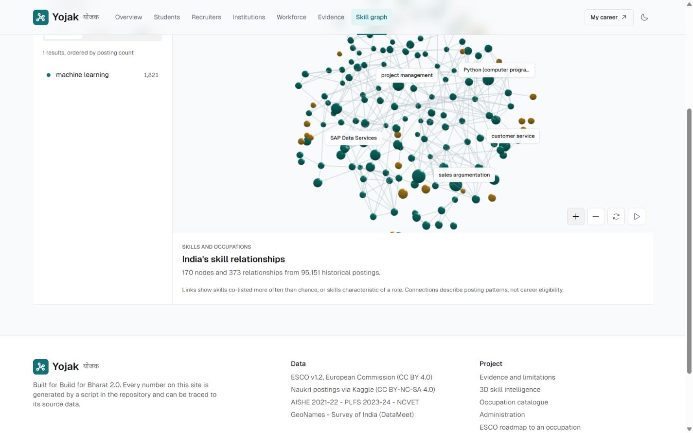

*Searchable graph workspace: the saved snapshot contains 170 nodes and 373 relationships from 95,151 historical postings. This is a selected visualization, not the full Neo4j graph.*

### Mobile experience

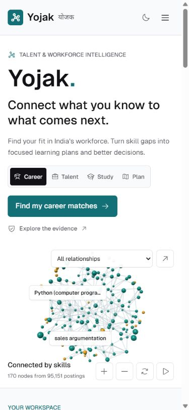

*Responsive navigation and the same graph data on a phone-sized viewport.*

### Reading guide

| For | Start here |
|---|---|
| Product reviewers | [Features](#features-and-use-cases), [end-to-end workflow](#how-it-works), [evidence](#measured-results) |
| Engineers | [Architecture](#architecture), [implementation](#runtime-boundaries), [setup](#getting-started), [API](#api-reference) |
| ML reviewers | [Ranking and planning](#3-rank-jobs-and-explain-the-match), [benchmarks](#benchmark-design), [compression](#efficiency-and-feature-compression) |
| Responsible deployment | [Deployment modes](#deployment-modes), [limitations](#limitations), [licensing](#attribution-and-licensing) |

## Why Yojak

A job title alone does not explain whether someone fits a role. A list of popular skills does not establish what they should learn next. A regional vacancy count does not explain how it relates to the local graduate supply.

Yojak combines these questions around a shared vocabulary of skills:

| Decision | Yojak's approach | What the result means |
|---|---|---|
| Which roles fit my profile? | Rank postings by skill similarity, then aggregate promising postings into occupations | Evidence of skill alignment with the dataset |
| What should I learn next? | Optimize the value of postings that cross a weighted skill-coverage threshold | A learning plan under an explicit eligibility definition |
| Which candidates cover a job's requirements? | Rank extracted or synthetic profiles by rarity-weighted skill coverage | A transparent screening aid |
| What is missing from our curriculum? | Compare syllabus skills with the most-demanded skills in a selected scope | A demand-weighted curriculum gap |
| Where is demand concentrated? | Compare state posting shares with graduate-supply shares | A coarse planning indicator |
| What does the role pay? | Estimate posted-salary quantiles and calibrate the interval | A range with support counts and disclosure-bias caveats |

These are decision-support signals. Skill coverage is not a prediction of hiring, and posted salary is not a promise of earnings.

## Features and use cases

| Workspace | Input and controls | Output | Example use case |
|---|---|---|---|
| **Student** · `/student` | ESCO skill search, free text, or a resume; state, city tier, and experience filters | Ranked roles and postings, skill gaps, explanation drawers, salary ranges, and learning plans | A fresher compares roles in Tier-2/3 cities and plans three additional skills |
| **Recruiter** · `/recruiter` | Paste or upload a JD, edit extracted skills, upload resumes, optionally include the synthetic pool | Ranked profiles with matched/missing skills and weighted coverage | Compare applicants against the same explicit requirements |
| **Institution** · `/institution` | Syllabus text or document; occupation group, skill family, state, and tier | Coverage of top-demand skills, missing skills, low-current-demand skills, CSV export | Review a course against postings in a chosen region |
| **Workforce** · `/workforce` | Skill-family selector and demand/shortage/youth-unemployment map modes | India map, state rankings and details, tier summaries, source caveats | Compare where formal-sector demand sits relative to graduate production |
| **Skill graph** · `/network` | Search, node selection, neighborhood inspection, rotate, zoom, reset | 3D view of co-listed skills and occupation-skill relationships with posting counts | Explore the evidence connecting a skill to roles and other skills |
| **Explore** · `/explore` | Occupation search and taxonomy filters | ESCO occupations and their essential/optional skills | Inspect the taxonomy behind a recommended role |
| **Evidence** · `/evidence` | Generated report index | Available reports, benchmark visualizations when populated, salary results, provenance, and pending states | Walk through the project's measured evidence |
| **Admin** · `/admin` | Diagnostics, occupation notes, and gold labelling | Graph counts, request latency, editable notes, and evaluation labels | Inspect operation and improve linking evaluation |

**Shared capabilities**

- English, Hindi, Punjabi, and romanised-Hindi input paths.
- PDF, DOCX, and plain-text extraction; the application does not persist uploaded resumes.
- Reusable skill selection, region filters, explanation drawers, loading states, and error states.
- Student role comparison for up to three roles, with posting counts, supported salary ranges, matched/missing skills, and CSV export. Saved-example exports identify their source; changing profiles clears the comparison.
- Live matching and learning-plan results are tied to their submitted inputs. Changing skills, filters, or plan settings prompts a fresh analysis before results are shown again.
- Salary responses with `p10`, `p50`, `p90`, `n_support`, and `sufficient`.
- Explicit `synthetic` labels for demo candidates.
- Light/dark themes, responsive layouts, and reduced-motion configuration.

The public UI focuses on the common controls. The API also exposes advanced options such as effort overrides and larger planning bounds.

The table describes the full-stack application. On the hosted demo, custom extraction and analysis require a reachable backend; saved stakeholder examples are explicitly labelled. See [deployment modes](#deployment-modes).

## Architecture

Yojak has two complementary data paths: Neo4j for taxonomy exploration and graph queries, and precomputed files plus sparse matrices for the newer stakeholder analytics.

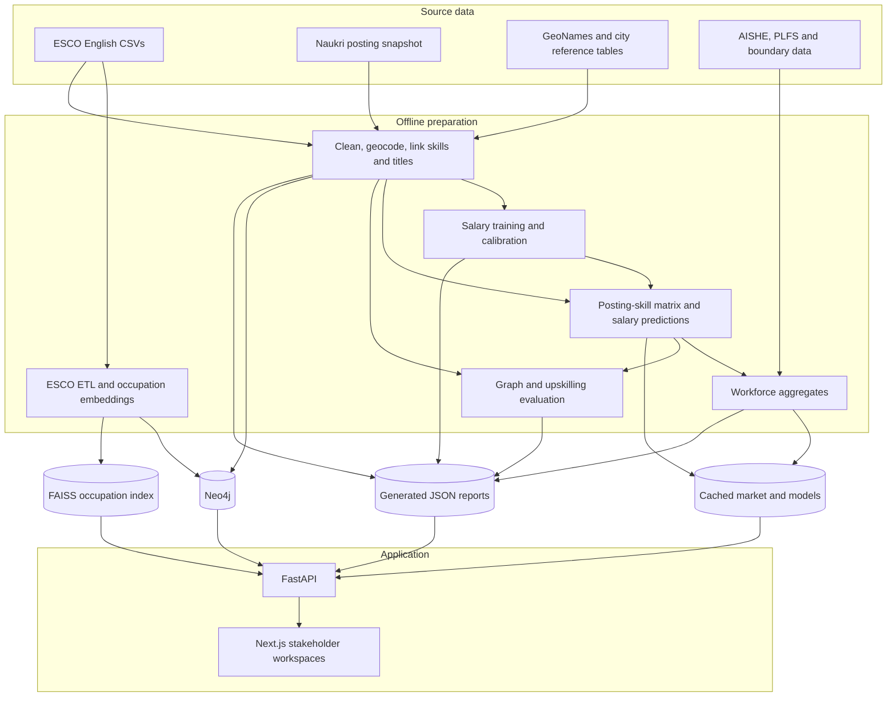

### Runtime boundaries

| Layer | Responsibility | Key implementation |
|---|---|---|
| API entry point | Router registration, Neo4j lifecycle, CORS, generic error responses, latency middleware | [main.py](app/api/main.py) |
| Routes and schemas | Request validation and response contracts | [routes](app/api/routes), [schemas](app/api/schemas) |
| Stakeholder services | Student matching/planning, recruiter ranking, curriculum coverage, salary requests | [yojak.py](app/api/services/yojak.py) |
| Serving state | Lazy market/model loading, ranker selection, labels, candidate pool, workforce tables | [serving.py](app/core/serving.py) |
| Shared extraction | Document parsing, language detection, exact matches, embedding fallback | [extract.py](app/core/extract.py) |
| Graph repositories | Parameterized Cypher for taxonomy, notes, and original recommendations | [repos](app/api/repos) |
| Frontend services | Typed Axios requests, shared errors, admin header, multipart uploads | [services](app/frontend/services), [api.ts](app/frontend/lib/api.ts) |
| Offline pipelines | Acquisition, preparation, evaluation, and artifact generation | [ml_pipeline](ml_pipeline) |

The original `POST /recommendations` endpoint remains available: it embeds a profile, searches the FAISS occupation index, and enriches results from Neo4j. The newer `POST /student/match` endpoint uses a posting-skill matrix and its selected sparse ranker. These are different recommendation paths.

### Deployment modes

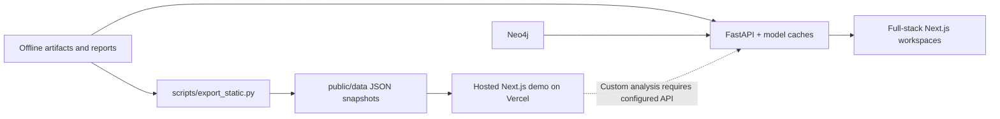

| Capability | Full-stack mode | Hosted snapshot mode |
|---|---|---|
| Student, recruiter, curriculum workflows | Compute against the loaded market | Browse saved service-generated examples |
| Custom text and document extraction | Available with models and source artifacts | Requires live API; examples are not fresh extraction |
| Workforce and skill network | API-derived aggregates | Exported aggregate JSON |
| Evidence | Allowlisted backend reports | Exported report JSON/Markdown; absent reports remain pending |
| Taxonomy explorer, original matcher, roadmap, admin | Backend/Neo4j dependent | Backend-required notice rather than a simulated response |
| Persistence | Neo4j notes and local gold-label files where implemented | No browser-side replacement for backend writes |

`NEXT_PUBLIC_STATIC_MODE=1` forces snapshot mode; `0` disables automatic selection. Otherwise, [static.ts](app/frontend/lib/static.ts) selects hosted mode when a non-local page is configured to call a localhost API. Snapshot-enabled read services also fall back on network failures, not on every HTTP error. This is **not** automatic cloud backend provisioning.

### 3D network implementation

The graph is an inspection tool, not an embedding-space model explanation. [graph.py](app/api/routes/graph.py) selects frequently requested skills and occupations. Skill-skill edges rank positive log-lift over chance with at least 30 shared postings; occupation edges select characteristic skills with at least 10 supporting postings.

[skill-network-scene.tsx](app/frontend/components/yojak/skill-network-scene.tsx) uses Graphology/ForceAtlas2 for the planar neighborhood layout, then adds deterministic depth for visual separation. The depth coordinate is **not a learned similarity or seniority score**.

| Interaction / safeguard | Implementation |
|---|---|
| Inspect relationships | Raycast node picking, search/list selection, highlighted neighborhoods |
| Navigate | Three.js OrbitControls, explicit zoom/reset/rotation buttons |
| Inspect magnitude | Node size follows posting count; labels disclose counts |
| Keep labels readable | Projected HTML buttons with collision and clipping checks |
| Reduce rendering work | Pixel ratio capped at 1.75; offscreen/hidden-tab rendering skipped; stationary clean scenes avoid redraw |
| Respect device constraints | Reduced-motion preference, responsive camera, WebGL-unavailable fallback |
| Release resources | Dispose geometry/materials/renderer and remove observers, listeners, and animation frame |

### Knowledge graph

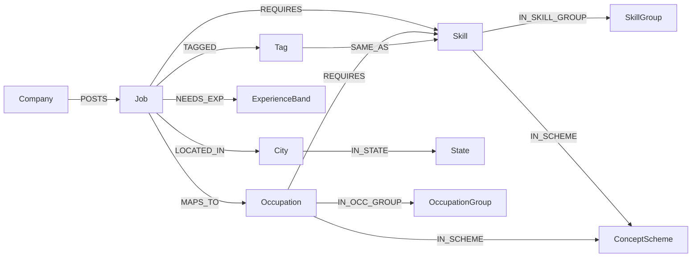

Unlinked tags remain `Tag` nodes. They are not silently converted into a possibly incorrect ESCO skill. Occupations carry an NCO-2015 family mapping where supported.

## How it works

### 1. Acquire and normalize the data

[acquire.py](ml_pipeline/acquire.py) downloads scriptable sources. ESCO's English CSV export is a manual prerequisite. Source locations and attribution are recorded in [data/SOURCES.md](data/SOURCES.md).

The [India pipeline](ml_pipeline/india/run.py):

1. Removes duplicate job IDs and normalizes skill tags.
2. Assigns near-duplicate groups using company, normalized title, and tag set. These groups are the split unit for evaluation.
3. Parses salary and experience fields. Zero salary is missing; one-sided ranges are completed; reversed bounds are normalized; implausible values are excluded from usable salary observations.
4. Splits multi-city locations and resolves city, state, and HRA-based tier using GeoNames, curated aliases, and conservative fuzzy matching.
5. Links tags and job titles to ESCO, maps eligible ISCO unit groups to four-digit NCO families, and writes Parquet tables.
6. Loads the India graph layer into Neo4j and writes a data-quality report.

USD-labelled salary rows are excluded by the configured pipeline policy rather than converted. City tiers use the reference table's HRA classification, not an inferred measure of city development.

Posting-date prefixes are checked against relative ages. The current report places **88.43% of raw postings within 14 days of the inferred scrape date, 2025-10-03**, but includes older outliers. This is a concentrated snapshot, not a longitudinal forecasting dataset.

### 2. Resolve text to a common skill vocabulary

The shared linker accepts ESCO preferred labels, alternative labels, and shortened preferred labels such as `Python` for `Python (computer programming)`.

| Step | Behavior |
|---|---|
| Document parsing | PDF text extraction, DOCX paragraphs/tables, or decoded text |
| Language routing | Script detection for Hindi/Punjabi and a heuristic for romanised Hindi |
| Exact lookup | Longest-match English n-grams over ESCO labels and accepted frequent posting tags |
| Semantic linking | Normalized embeddings, FAISS inner-product search over labels, maximum label similarity per concept |
| Acceptance | Thresholded linking with a stricter guard for ambiguous one-word English tags |
| Explanation | Preserve the source phrase, method, similarity score, and unlinked phrases |

The current default English skill threshold is **0.70**, with a **0.80** one-word embedding guard. Multilingual extraction uses the multilingual MPNet model and a provisional threshold derived from the English threshold. These values are configuration decisions, not measured accuracy.

Job-title linking also uses the posting's skills to resolve near-ties between plausible occupations. Exact title matches are preserved. See [link.py](ml_pipeline/india/link.py).

### 3. Rank jobs and explain the match

A market artifact stores a sparse posting-by-skill matrix `R`, skill identifiers, integer IDF weights, posting metadata, and predicted salary ranges.

For a candidate profile:

1. Resolve input skills to ESCO URIs.
2. Filter postings by state, tier, and experience band.
3. Rank the filtered rows with TF-IDF cosine similarity or Adamic-Adar common-neighbour scoring.
4. Calculate skill fit separately as the IDF-weighted fraction of a posting's skills covered.
5. Return matched skills, the most important missing skills, and score changes when individual input skills are removed.
6. Aggregate the best 500 postings by ESCO occupation to propose roles.

**Score and fit are different.** A ranker's similarity score determines ordering; fit describes coverage of the job's listed skills. Neither is a hiring probability.

**Model-selection behavior:** the benchmark compares six models, but the current runtime supports only **B1 TF-IDF kNN** and **B3a Adamic-Adar**. It serves the benchmark winner when supported, otherwise the best supported model by reported T3 NDCG@10. Without a benchmark report it defaults to B1. Responses disclose both the benchmark winner and the served model. HGT is implemented for evaluation; it is not currently an online serving option.

### 4. Choose the next skills to learn

Let `S` be the person's skills, `R_j` a posting's required skills, `w_s` a skill's rarity weight, and `tau` the eligibility threshold.

```text
w_s       = round(1000 * (log((1 + number_of_jobs) / (1 + jobs_with_skill_s)) + 1))
fit(S, j) = sum(w_s for s in R_j intersect S) / sum(w_s for s in R_j)
eligible  = fit(S, j) >= tau

F(A) = sum_j value_j * indicator(fit(S union A, j) >= tau)
G(A) = sum_j value_j * min(1, fit(S union A, j) / tau)
```

`F` is the actual objective: maximize eligible posting value after learning at most `k` skills. Value is either one per posting or its predicted median salary. `G` also rewards partial progress.

| Method | Purpose | Guarantee or qualification |
|---|---|---|
| Frequency baseline | Choose commonly requested missing skills | No optimality guarantee; salary mode weights counts by posting value |
| Lazy greedy on G | Efficient surrogate optimization | The `1 - 1/e` guarantee applies to G, not F |
| Greedy on F | Prioritize skills that complete postings; break ties using G | Fast heuristic without a worst-case guarantee on F |
| CP-SAT ILP | Optimize F subject to the skill count or effort budget | Proven optimum only when the solver reports optimality |
| Effort-aware partial enumeration | Extend affordable seed sets with gain-per-effort greedy | Practical bounded search; effort is a heuristic, not learning time |
| Brute force | Cross-check small instances | Exact for the enumerated instance |

The student API starts with greedy on F, gives CP-SAT a **1.5-second solver limit**, and retains the better plan. Model construction and other request work are outside that solver limit. It compares the result with frequency advice and reports whether optimality was proven.

Each step identifies newly eligible postings, cumulative eligibility, effort, and a salary-shift range where available. The API supports `k = 1..8`, `tau = 0.3..0.9`, optional effort budgets, and per-skill effort overrides. The UI offers a narrower set of common choices.

F is **not submodular**: two skills may unlock a posting together while neither does alone. The mathematical distinction and solver formulation are documented in [docs/optimality.md](docs/optimality.md).

### 5. Estimate salary with uncertainty

[salary/model.py](ml_pipeline/salary/model.py) predicts the **annual INR midpoint of a posted salary range**, using only postings with a plausible disclosed salary.

- Features include occupation group, state, tier, metro region, work mode, experience, rating, and compressed title/skill text features.
- Three LightGBM models estimate log-salary quantiles at P10, P50, and P90.
- Near-duplicate groups are assigned to train/calibration/test splits.
- Split-conformal calibration adjusts the outer interval toward 80% coverage.
- A support count tracks disclosed examples for the same ISCO unit group and tier; the salary-estimate endpoint pools support across tiers when no tier is supplied. The shared salary component suppresses individual estimates below **20** examples.
- The API still returns numeric predictions with `sufficient: false`; API consumers must honor that flag.

The evaluation also measures whether disclosure is predictable, and compares an inverse-propensity-weighted sensitivity model. This does not eliminate unobserved salary-selection bias.

### 6. Answer recruiter, curriculum, and workforce questions

**Recruiter ranking.** A JD defines the required skill set. Candidates receive IDF-weighted coverage plus a small logarithmic breadth term. This is a separate scoring rule from student job ranking. Demo profiles are explicitly synthetic; uploaded profiles are extracted for the request. The route processes up to 20 resumes.

**Curriculum coverage.** Within the chosen scope, the service finds the top requested skills, defaulting to 40. Coverage is the share of their posting-frequency weight covered by syllabus skills. A taught skill appearing in fewer than **0.2%** of scoped postings is labelled “low current demand,” not “outdated.”

**Workforce analytics.** ESCO knowledge concepts are mapped through their hierarchy to ISCED-F broad fields. A posting receives its most frequent mapped field, or `unassigned`. The shortage proxy is:

```text
shortage(field, state)
    = [postings(field, state) / postings(field, India)]
      / [graduates(state) / graduates(India)]
```

Supply uses **state-total AISHE graduate out-turn**, not field-specific graduate counts. PLFS youth unemployment is shown alongside the index; it is not the supply denominator. A value above one indicates disproportionate posting demand relative to graduate share, not a measured count of unfilled vacancies.

### 7. Deliver the answer

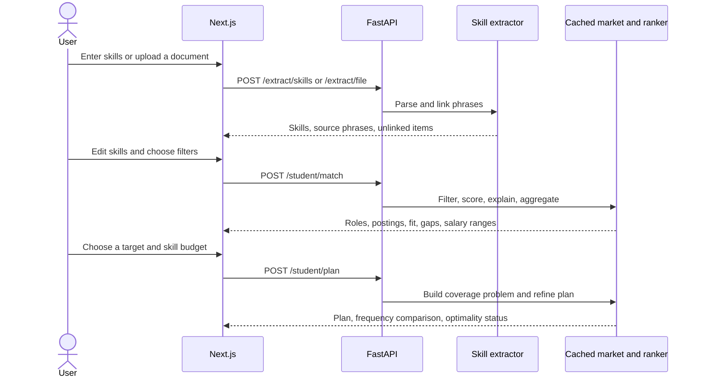

## Measured results

The block below is generated by [scripts/render_readme.py](scripts/render_readme.py). Its numbers come from the JSON reports, and CI checks that this block matches those reports. Missing reports remain pending.

| Evidence | Current report set | What it establishes |
|---|---|---|
| [Data quality](reports/data_quality.json) | Available | Cleaning counts, geography, linking coverage, graph counts, stage timing |
| [Salary evaluation](reports/salary_eval.json) | Available | Held-out errors, interval coverage, subgroup results, disclosure bias |
| [Workforce summary](reports/workforce_summary.json) | Available | Field assignments, state supply coverage, shortage proxy, tier aggregates |
| Graph comparison and ablations | Pending | No published winner or comparative latency yet |
| Upskilling and impact | Pending | No published real-pool optimality-gap or impact estimate yet |
| Gold and multilingual accuracy | Pending labels/evaluation | Implementation exists; accuracy is not established |

**Reading the evidence:** reports record the generating script, timestamp, seed where applicable, Git state, and supplied input hashes. The available September 25, 2026 reports record a dirty working tree based on the pre-reset upstream commit. They are historical run evidence, not proof that every later edit has been reevaluated.

<!-- results:start -->

### Data (from `reports/data_quality.json`)

|  |  |
| --- | ---: |
| Raw postings | 97,929 |
| After removing duplicate job IDs | 97,679 |
| Jobs with at least one skill tag | 97,108 |
| Non-remote jobs resolved to an Indian city | 99.7% (1,410 cities, 34 states/UTs) |
| Jobs by primary city tier (1 / 2 / 3) | 60,353 / 26,131 / 8,813 |
| Unique skill tags | 43,716 (753K mentions) |
| Tag mentions linked to an ESCO skill | 54.6% (threshold 0.7, provisional) |
| Jobs linked to an ESCO occupation | 77.0% (1,949 distinct occupations) |
| Postings that disclose salary | 33.9% (Tier 1: 26.9%, Tier 2: 43.8%, Tier 3: 50.6%) |
| Posting dates | real, from `jobId`; 86.9% agree with "N days ago"; inferred scrape date 2025-10-03 |
| Skill-linking precision (team-labelled gold) | *pending team labels* |

### Models (from `reports/model_comparison.json`)

*Pending:* T1 job-skill completion, T2 occupation-skill recovery and T3 candidate→job fit for B0 Popularity, B1 TF-IDF kNN, B2 SkillAlign (mpnet + FAISS), B3a Adamic-Adar, B3b LightGCN and the HGT.

### Upskilling (from `reports/upskilling_eval.json`)

*Pending:* jobs unlocked by lazy greedy, greedy on F and top-k-by-frequency against the exact optimum, for k ∈ {1, 3, 5} and τ ∈ {0.4, 0.6, 0.8}.

### Salary (from `reports/salary_eval.json`)

|  |  |
| --- | ---: |
| Model | LightGBM quantile regression + conformalised quantile regression |
| Held-out postings (disclosed salary) | 4,953 |
| P50 MAE / MdAPE | ₹2.73 L / 21.4% |
| Baseline (ISCO sub-major × tier median) MAE / MdAPE | ₹4.73 L / 44.2% |
| P10-P90 coverage (target 80%): raw → calibrated | 68.4% → 79.7% |
| Median interval width (calibrated) | ₹4.24 L |
| Disclosure predictable from job features (propensity AUC) | 0.89 |
| Shown only when support ≥ | 20 similar disclosed postings |

Salary is disclosed on only 33.9% of postings and disclosure is not random, so every figure is a range for *postings that disclose pay*, never a point estimate.

### Impact (from `reports/impact.json`)

*Pending:* extra eligible postings for Tier-2/3 freshers from a 3-skill optimal plan compared with frequency advice, with every assumption listed.

<!-- results:end -->

### Salary comparison

The following charts are **fixed visual snapshots of the September 25, 2026 salary report**. The generated tables above remain the refreshable results source. The baseline predicts the training median for the same ISCO sub-major group and city tier.

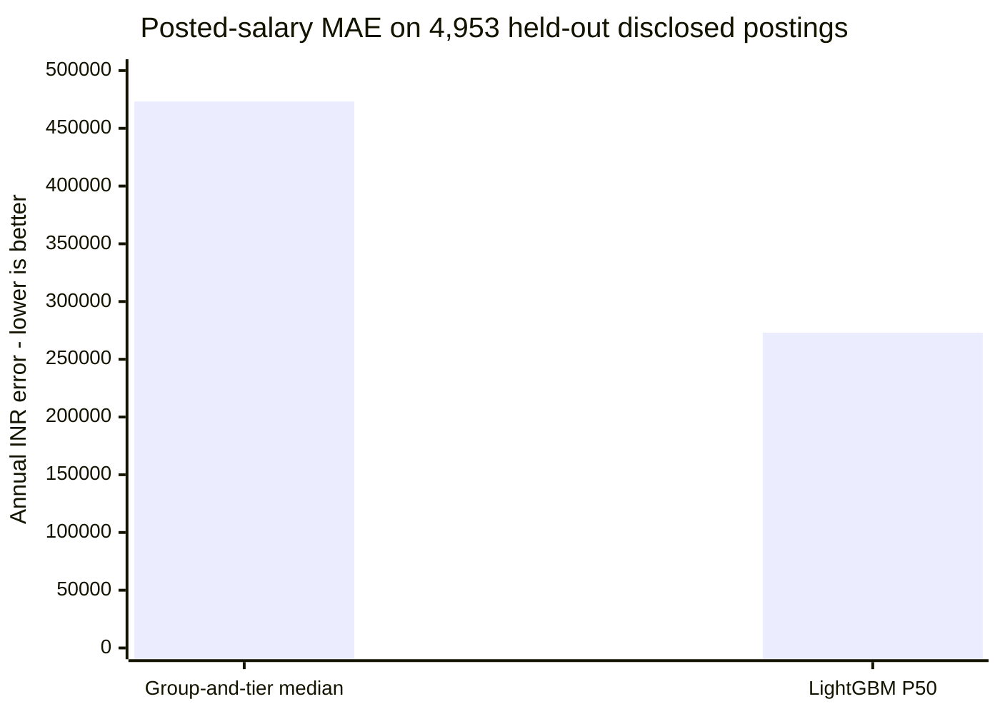

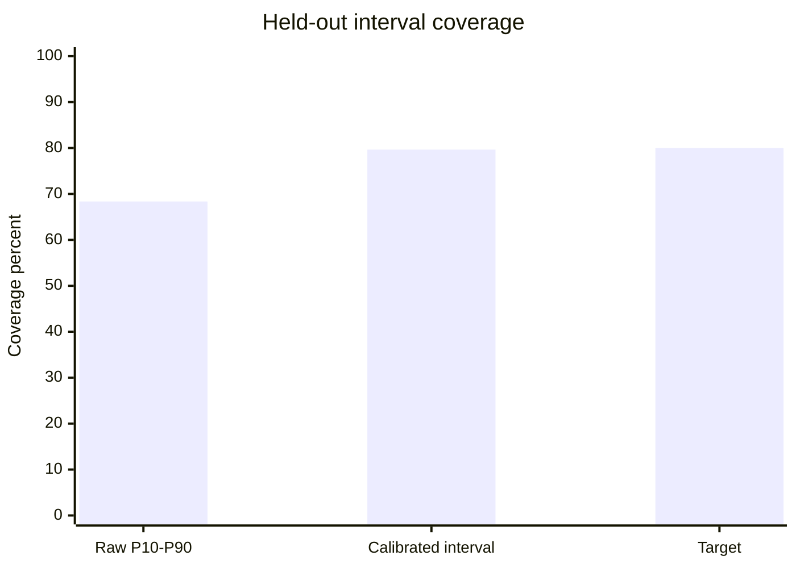

The model's MAE is **42.3% lower than the baseline**, calculated as `1 - 273040 / 473227`. Calibration increases observed coverage by **11.29 percentage points**. These comparisons apply to the disclosed-salary test set only.

The uncertainty remains substantial: median calibrated interval width is **INR 423,787**, and the disclosure-propensity classifier's AUC is **0.8919**. A strong ability to predict who discloses pay is evidence that the labelled sample is not random. Source: [salary_eval.json](reports/salary_eval.json).

### Data coverage is not linking accuracy


This is a **September 25, 2026 data-quality snapshot**, not four independently filtered training sets. All cleaned postings remain in the India layer; the market used by stakeholder analytics keeps postings with linked skills.

The latest data report records 43,716 unique raw tags, 16,587 accepted unique tags, and 4,364 distinct linked ESCO skills. Many source phrases share a concept, and others remain unlinked. Coverage describes how much data can be mapped; precision still requires the pending gold labels. Source: [data_quality.json](reports/data_quality.json).

## Benchmark design

### Six models, three tasks

| Model | Method | Role in the codebase |
|---|---|---|
| B0 | Popularity | Frequency-based baseline |
| B1 | TF-IDF kNN | Sparse similarity baseline; supported student runtime |
| B2 | MPNet + FAISS | SkillAlign-derived semantic baseline; original recommender family |
| B3a | Adamic-Adar | Rarity-weighted common-neighbour baseline; supported student runtime |
| B3b | LightGCN | Learned graph-propagation baseline |
| M | Heterogeneous Graph Transformer | Typed graph model adapted from Vyuha; benchmark implementation |

| Task | Query | Evaluation target |
|---|---|---|
| **T1: job-skill completion** | A held-out posting's known skills | Its hidden skills |
| **T2: occupation-skill recovery** | An occupation's known ESCO skills | Its hidden occupation-skill edges |
| **T3: candidate-to-job fit** | A pseudo-profile made from a posting's skills plus noise | Source posting and same-occupation postings in the evaluation pool |

The split hashes near-duplicate groups into approximately **70% train / 10% validation / 10% test / 10% pool**. Validation/test jobs with sufficient skills hide half their edges; occupations with at least five skills hide approximately 20%. Separate train-job pseudo-profiles support T3 model tuning.

T3 profiles retain 40–70% of a source posting's skills and add two noise skills. The source job receives relevance grade 2, and same-occupation jobs grade 1. It is a **proxy task** because there are no applications, interviews, or hiring outcomes.

### What the evaluation records

| Dimension | Recorded measure |
|---|---|
| Retrieval quality | Recall@10, NDCG@10, MRR |
| Uncertainty | Query-bootstrap 95% intervals and paired differences |
| Stochastic variation | Three seeds by default for learned models |
| Query cost | p50/p95 latency for profile-to-skills and profile-to-jobs scoring |
| Memory | Process RSS; peak CUDA allocation when available |
| Structural checks | Hidden/known edge overlap and near-duplicate split overlap |
| Ablations | Raw tags instead of ESCO skills; removal of company/city context; one HGT layer; temporal encoding |
| Planning quality | Objective value, gap against ILP, optimality status, runtime, and budget feasibility |

T3 Recall@10 specifically asks whether the source posting appears in the top ten. Model selection uses T3 NDCG@10, with T1 NDCG@10 breaking the implemented confidence-interval-overlap tie. Runtime support is checked separately.

The report averages stochastic-model metrics over seeds but takes query confidence intervals and latency/memory summaries from the last run. Paired comparisons also use the last run's per-query results. These intervals should not be presented as uncertainty over every seed.

**No graph winner, model speedup, or measured upskilling advantage is claimed until the corresponding report exists.** Source: [graph/evaluate.py](ml_pipeline/graph/evaluate.py).

### HGT implementation

The HGT operates on job, skill, occupation, company, city, and experience-band nodes with reverse relations. It combines typed attention with a projected bag of skill features, uses DistMult-style job-skill/occupation-skill scoring, and learns a candidate-job correction over a text prior.

Training uses BPR and contrastive objectives, AdamW, a cosine learning-rate schedule, early stopping, and context dropout. Known training edges are repartitioned into message-passing and supervision edges during training. Candidate nodes are encoded inductively against cached skill states. Posting-time encoding is an optional ablation.

See [hgt/model.py](ml_pipeline/graph/hgt/model.py) and [CREDITS.md](CREDITS.md) for implementation and reuse boundaries.

## Efficiency and feature compression

### Where work is reduced

| Mechanism | Implementation | Practical effect |
|---|---|---|
| Sparse posting-skill matrices | SciPy CSR for row operations; CSC for skill-column operations | Work follows observed edges instead of materializing every job-skill pair |
| Cached serving state | Lazy singleton with cached market, ranker, labels, salary model, and candidate pool | Reuses loaded resources within a process |
| Cached label embeddings | Text/model-derived cache key in the linker | Avoids regenerating unchanged label embeddings |
| Precomputed salary predictions | Stored alongside market rows | Matching can attach salary ranges without fitting models per request |
| Vectorized marginal gains | Sparse candidate-column pass in the planner | Computes gains together instead of a Python loop over every skill |
| Lazy greedy | Priority queue with stale-gain recomputation | Avoids recomputing every surrogate gain each round |
| Bounded ILP refinement | Greedy hint plus solver time limit | Limits the solver phase while preserving a feasible fallback |
| Partial top-k selection | NumPy `argpartition` | Avoids fully sorting every candidate for a small result set |
| Frontend query caching | React Query; reports have a 10-minute stale time | Reuses recent responses |
| Request metrics | Last 500 durations per route template | Bounded, process-local latency observation |

These are implementation mechanisms, not measured claims of end-to-end speedup. First-request loading, extraction, database work, and CPU contention still affect response time.

### Compression visualization

Yojak performs **feature dimensionality reduction**, not document or model-weight compression. The salary feature builder fits each text representation on training rows and projects it into 32 dimensions:

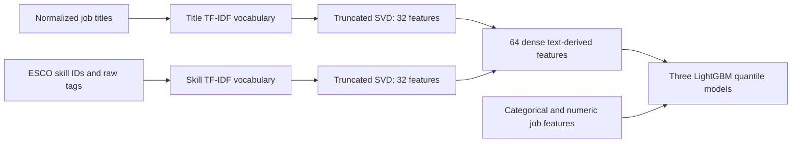

| Representation | Reduction or storage approach | What can be claimed |
|---|---|---|
| Salary text features | Two independent 32-component SVD projections | 64 text-derived features, plus structured inputs |
| Job-skill relationships | Sparse CSR/CSC matrices | Storage of observed relationships and indexing metadata |
| Skill vocabulary | Many accepted surface forms mapped to shared ESCO concepts | Semantic normalization with retained unlinked tags |
| Original FAISS occupation index | Flat L2 search over normalized vectors | Exact flat-index search; no product quantization |
| Linking FAISS index | Flat inner-product search | Similarity lookup; no measured index-compression ratio |

The reports do not provide source vocabulary dimensions, dense-versus-sparse byte comparisons, explained-variance totals, or compression benchmarks. A percentage memory reduction or “times smaller” chart would therefore be unsupported. Source: [salary/model.py](ml_pipeline/salary/model.py).

### Recorded processing time

The data-quality report includes these stage durations from one run:

| Stage | Recorded seconds |
|---|---:|
| Acquisition/read | 0.64 |
| Cleaning | 3.30 |
| Geography | 8.20 |
| Skill linking | 159.59 |
| Title linking | 87.84 |
| NCO mapping | 0.10 |
| Saving tables | 8.23 |
| Neo4j loading | 139.33 |
| Salary evaluation run, separate report | 195.30 |

Sources: [data_quality.json](reports/data_quality.json), [salary_eval.json](reports/salary_eval.json). Hardware and cold-cache conditions are not fully recorded, so these are run observations, not portable performance guarantees. API throughput, cold-start latency, and graph-model p50/p95 comparisons are not yet published.

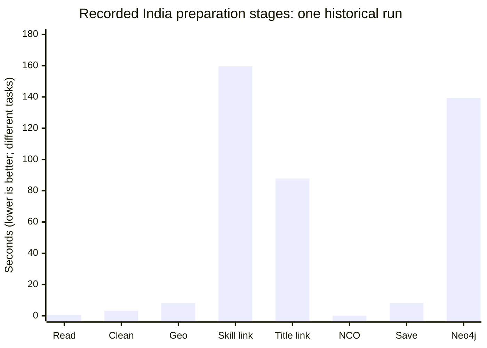

This chart locates work within that run; it does not compare competing algorithms or establish a speedup. The separate salary evaluation duration is excluded from the preparation chart.

### Performance evidence checklist

| Claim | Evidence status | Interpretation |
|---|---|---|
| Salary error versus simple baseline | Measured | MAE 273,040 vs 473,227 annual INR on disclosed-salary test postings |
| Calibrated salary interval coverage | Measured | 79.65% observed overall versus an 80% target; subgroup coverage differs |
| Preparation stage duration | Recorded | One run with incomplete hardware/cold-cache metadata |
| 32 + 32 salary text features | Implemented | Fixed dimensionality, not a measured byte-compression ratio |
| Graph retrieval p50/p95 and RSS | Evaluator implemented; report pending | Do not infer online speed from architectural choices |
| Production throughput, concurrency, uptime | Not published | No production SLA or capacity claim |
| Hiring, placement, retention, learner outcomes | Not measured | Proxy eligibility and alignment do not establish causal impact |

## Technology stack

| Area | Technology | Usage |
|---|---|---|
| Backend | Python 3.11, FastAPI, Pydantic, Uvicorn | Typed HTTP API and settings |
| Graph database | Neo4j Community 5.26.31 in setup scripts | Taxonomy, graph relationships, and notes |
| Numerical data | NumPy, pandas, SciPy, PyArrow, joblib | Preparation, sparse matrices, persisted artifacts |
| Text representations | Sentence Transformers, English and multilingual MPNet, FAISS | Skill linking and semantic occupation retrieval |
| Learned graph models | PyTorch, LightGCN, custom HGT | Offline comparison and ablations |
| Salary | LightGBM, scikit-learn | Quantile prediction, text SVD, bias analysis |
| Optimization | OR-Tools CP-SAT | Exact or time-bounded learning-plan refinement |
| Document and place parsing | pdfplumber, python-docx, RapidFuzz | Resume/syllabus extraction and geography |
| Web application | Next.js 14, React 18, TypeScript | App Router pages and typed services |
| UI and state | Tailwind, Radix primitives, React Query, Axios, Motion, next-themes | Controls, requests, animation, themes |
| Visualization | D3 geo/scale, Graphology/ForceAtlas2, Three.js + OrbitControls | India map, network layout, interactive 3D skill graph |
| Quality and automation | pytest, Ruff, TypeScript, ESLint, GitHub Actions | Unit/API tests, integration checks, lint and build |

Python dependencies are specified in [requirements.txt](requirements.txt) and [requirements-dev.txt](requirements-dev.txt). Frontend dependencies and resolved versions are in [package.json](app/frontend/package.json) and [package-lock.json](app/frontend/package-lock.json).

## Getting started

### Frontend-only demo

The committed snapshots allow presentation without downloading datasets, running Neo4j, or loading Python models. This mode uses saved examples, not custom inference.

```powershell
cd app/frontend
npm ci
$env:NEXT_PUBLIC_STATIC_MODE = '1'
npm run dev
```

Open [localhost:3000](http://localhost:3000). For Bash, set `NEXT_PUBLIC_STATIC_MODE=1 npm run dev` after `npm ci`. For a production preview, set the same variable before `npm run build`, then run `npm run start`. Public Next.js variables are build-time configuration for production builds.

For the full analytical system, follow the prerequisites and pipeline below.

### Prerequisites

- Git, Python **3.11**, Node.js **20**, npm, and Java **17** are the documented setup/CI targets.
- Network access for dependency installation, embedding models, and source downloads.
- Kaggle credentials for the Naukri dataset.
- The ESCO v1.2 English CSV export, placed directly in `data/raw/esco/`.
- Sufficient memory and disk for the graph, data, embedding models, and artifacts. No validated minimum hardware specification is published; CUDA is optional for serving and useful for learned-model evaluation.

```bash
git clone https://github.com/Aditya060806/Yojak.git
cd Yojak
```

### Windows / PowerShell

```powershell
# Install dependencies, create local configuration, and install Neo4j.
./scripts/setup.ps1 -Torch cpu

# Place the ESCO English CSVs in data/raw/esco/ before continuing.
# Configure Kaggle credentials as required by the Kaggle CLI.
./scripts/run.ps1 data
./scripts/run.ps1 pipeline

# Refresh documentation from reports already generated.
./.venv/Scripts/python.exe -m ml_pipeline.evaluate_all --only docs

# Start Neo4j, the API, and the production frontend.
./scripts/run.ps1 up
```

Use `-Torch cuda` for the script's CUDA 12.1 PyTorch wheel, or `-Torch skip` to retain an existing installation.

### Linux / macOS scripts

Bash equivalents are included in the repository:

```bash
bash scripts/setup.sh --torch cpu
# Place ESCO CSVs and configure Kaggle credentials.
bash scripts/run.sh data
bash scripts/run.sh pipeline
.venv/bin/python -m ml_pipeline.evaluate_all --only docs
bash scripts/run.sh up
```

The Bash scripts are provided for these platforms; CI exercises Linux components. macOS dependency installation is not independently established by the checked-in results. Source downloads may need manual handling when a publisher blocks scripted access; see the acquisition output and [source inventory](data/SOURCES.md).

### Local services

| Service | Address |
|---|---|
| Web application | [localhost:3000](http://localhost:3000) |
| Interactive API docs | [127.0.0.1:8000/docs](http://127.0.0.1:8000/docs) |
| Neo4j browser | [127.0.0.1:7474](http://127.0.0.1:7474) |
| Neo4j Bolt | `neo4j://127.0.0.1:7687` |

The `up` runner uses ports 8000 and 3000 and stops existing listeners on those ports. It reuses an existing Next.js production build. After frontend edits, use the `web` task to rebuild or the `dev` task for development.

### Pipeline stages and artifact dependencies

```text
graph -> index -> india -> salary -> supply -> synthetic -> serving
```

This is the runner's order, not a claim that every stage depends on every earlier stage.

| Stage | Primary output | Required by |
|---|---|---|
| `graph` | ESCO nodes and relations in Neo4j | Explorer, catalog, notes, original recommender |
| `index` | `data/processed/occupation.index` and metadata CSV | Original FAISS recommender |
| `india` | `data/processed/india/*.parquet`, graph additions, data-quality report, initial gold samples | Matching, downstream models, evaluation |
| `salary` | Salary model and evaluation report | Market construction and salary endpoints |
| `supply` | Government reference tables, map GeoJSON, workforce tables and report | Workforce workspace |
| `synthetic` | Explicitly labelled demo candidate pool | Optional recruiter demo |
| `serving` | English and multilingual label-embedding caches | Extraction warm preparation |

The market artifact at `artifacts/upskilling/market.joblib` is built when needed and refreshed against posting/salary artifact modification times. A fresh clone does not include the raw datasets, processed market, trained salary model, or local Neo4j installation.

Run selected stages when their prerequisites already exist:

```powershell
./scripts/run.ps1 pipeline --stages india salary
./scripts/run.ps1 api
# In a second terminal:
./scripts/run.ps1 dev
```

### Configuration

Settings load from the repository-root `.env`; relative data paths resolve against the repository root. The browser reads `app/frontend/.env.local`.

| Variable | Purpose |
|---|---|
| `NEO4J_URI`, `NEO4J_USER`, `NEO4J_PASSWORD` | Graph connection |
| `ESCO_DATA_DIR`, `NAUKRI_DATA_DIR`, `EXTERNAL_DATA_DIR` | Raw source locations |
| `PROCESSED_DATA_DIR`, `ARTIFACTS_DIR`, `REPORTS_DIR` | Generated data, models, and reports |
| `MODEL_NAME` | English embedding model |
| `MULTILINGUAL_MODEL_NAME` | Multilingual embedding model |
| `FAISS_INDEX_PATH` | Original occupation index |
| `CORS_ORIGINS` | Allowed frontend origins |
| `ENVIRONMENT`, `ADMIN_TOKEN` | Environment and admin-write guard |
| `WARM_UP_MODELS` | Background warm-up of the original ML engine |
| `NEXT_PUBLIC_API_URL` | Browser-visible API URL |
| `NEXT_PUBLIC_STATIC_MODE` | `1`: hosted examples/snapshots; `0`: live mode; unset: automatic hosted-mode selection |

See [.env.example](.env.example) for defaults. The admin UI stores its token in tab-scoped session storage and sends `X-Admin-Token`. With no token configured, guarded writes are allowed only in development; other environments return a configuration error. This is a demo-grade guard, not user authentication or role-based access control.

### Troubleshooting

| Symptom | Check |
|---|---|
| Catalog or graph routes fail | Neo4j is running, credentials match, and the graph stage completed |
| Original recommendations return unavailable | The FAISS index and aligned metadata exist and match the embedding model |
| Student or workforce routes report missing files | India, salary, and supply stages completed; report JSON alone is insufficient |
| First extraction is slow | Model download/loading and label-index initialization may be occurring |
| Evidence shows pending | Generate the corresponding report; missing evidence is not synthesized |
| UI cannot reach the API | `NEXT_PUBLIC_API_URL`, API process, and CORS origins |
| Admin writes fail | Token configuration and the UI's admin settings |
| Production UI looks outdated | Rebuild with the `web` task; `up` may reuse the previous build |
| Hosted page is configured to call localhost | Configure a reachable API and CORS, or use explicitly labelled snapshot mode |
| README/evaluation freshness check fails | Run both documentation generators and include both generated documents in the commit |

### Refresh hosted snapshots

After building the required artifacts and refreshing reports:

```bash
python scripts/render_readme.py
python scripts/build_evaluation.py
python scripts/export_static.py
```

The exporter replaces `app/frontend/public/data/` with report snapshots, workforce aggregates, skill vocabulary, graph data, and saved persona results. It calls the actual service layer to generate examples; it does not hand-author answers. Inspect exported evidence and attribution before publishing. Rebuild the frontend after changing public environment variables.

## API reference

FastAPI's [local OpenAPI UI](http://127.0.0.1:8000/docs) is the authoritative request/response reference.

| Area | Endpoints | Notes |
|---|---|---|
| Health | `GET /health` | Graph health |
| Diagnostics | `GET /admin/diagnostics/nodes-by-label`, `/rels-by-type`, `/endpoints`, `/metrics` | Counts, route inventory, process-local latency |
| Catalog | `GET /catalog/skills`, `/occupations`, `/occupation-groups`, `/skill-groups`, `/concept-schemes` | Search/filter choices |
| Taxonomy | `GET /occupations`, `GET /occupations/{uri}/skill-gap`, `GET /skills` | URL-encode occupation URIs |
| Extraction | `POST /extract/skills`, `POST /extract/file` | JSON text or multipart file |
| Student | `POST /student/match`, `POST /student/plan` | JSON profiles and planning options |
| Recruiter | `POST /recruiter/rank` | Multipart JD, JSON-encoded skill list, optional resumes |
| Institution | `POST /institution/coverage` | Multipart syllabus and scope |
| Jobs | `GET /jobs`, `GET /jobs/{job_id}`, `GET /jobs/{job_id}/path` | Search, details, graph explanation |
| Workforce | `GET /workforce/fields`, `/demand`, `/shortage` | Aggregated demand and supply proxy |
| Salary | `GET /salary/estimate` | Quantiles, support, basis, caveats |
| Visualization | `GET /graph/constellation` | Skill co-occurrence and occupation graph |
| Reports | `GET /reports`, `GET /reports/{name}` | Allowlisted JSON/Markdown reports |
| Notes | `GET /notes`; `PUT`/`DELETE /notes/admin/occupations/{uri}/notes/{note_id}` | Writes require the admin guard |
| Labelling | `GET /admin/labelling/{task}/items`, `POST /admin/labelling/{task}/labels`, `GET /admin/labelling/progress` | Skills, titles, and multilingual gold data |
| Original recommender | `POST /recommendations` | FAISS + Neo4j occupation matching |

**Example: match a text profile**

```bash
curl -X POST http://127.0.0.1:8000/student/match \
  -H "Content-Type: application/json" \
  -d '{"text":"Python, SQL, Excel","tiers":[2,3],"exp_bands":["0-1"],"limit":5}'
```

**Example: plan three additional skills**

```bash
curl -X POST http://127.0.0.1:8000/student/plan \
  -H "Content-Type: application/json" \
  -d '{"text":"Python, SQL","target_isco2":"25","k":3,"tau":0.6,"value":"count"}'
```

These are request examples, not fabricated response examples. Their results depend on locally generated artifacts.

## Evaluation and verification

### Generate evidence

With the virtual environment activated and prerequisite artifacts built:

```bash
# Full evaluation sequence: benchmark, upskilling, multilingual, gold, impact, docs.
python -m ml_pipeline.evaluate_all

# Smaller evaluation run; the graph smoke report has a separate filename.
python -m ml_pipeline.evaluate_all --quick

# Individual evaluations.
python -m ml_pipeline.graph.evaluate
python -m ml_pipeline.upskilling.evaluate
python -m ml_pipeline.india.multilingual

# Gold-label workflow.
python -m ml_pipeline.india.gold sample
python -m ml_pipeline.india.gold tune
python -m ml_pipeline.india.gold evaluate

# Refresh documentation without retraining.
python -m ml_pipeline.evaluate_all --only docs

# Persona-based demo through the service layer; requires artifacts, not an API server.
python scripts/demo.py
```

Label the frozen samples through `/admin/labelling` before tuning or interpreting gold accuracy. The intended workflow tunes on dev labels and reports held-out test labels. Model-assisted team labels are not an independent external annotation study.

Run performance evaluations in isolation: concurrent training or heavy workloads distort latency measurements. Quick mode is a smoke test, not a replacement for the full benchmark.

### Checks

```bash
python -m pytest
python -m ruff check app ml_pipeline tests scripts
python scripts/render_readme.py --check
python scripts/build_evaluation.py --check

cd app/frontend
npx tsc --noEmit
npm run lint
npm run build
```

| Test area | Coverage in the suite |
|---|---|
| Original recommendation path | L2-to-cosine conversion, index consistency, skill gaps, filters |
| India preparation | Salary/experience rules, tag cleanup, geography, aliases, linking |
| API contracts | Real service code with a small in-memory market and substituted resources |
| Optimization | ILP versus brute force, lazy versus naive greedy, eligibility, budgets |
| Components | Ranking metrics, runtime rankers, model fallback, extraction helpers, calibration, reporting |
| Neo4j integration | ETL relationships, idempotency, API queries, India-layer loading |

Live integration tests require `NEO4J_TEST_URI`, `NEO4J_TEST_USER`, and `NEO4J_TEST_PASSWORD` targeting a **disposable database**. They can delete its data and refuse a nonempty database without their test marker. Without the URI, these tests are skipped.

[GitHub Actions](.github/workflows/ci.yml) defines backend lint/tests, a separate live-Neo4j integration job, frontend typecheck/lint/build, shell parsing, and generated-document freshness checks. Defining these checks is not a claim that every current checkout passes them.

## Repository map

```text
app/
  api/
    routes/                 HTTP endpoints
    schemas/                Request and response models
    services/               Business logic
    repos/                  Neo4j data access
  core/
    settings.py             Repository-relative configuration
    extract.py              Text/document-to-skill extraction
    serving.py              Market, models, rankers, cached state
    ml.py                   Original embedding + FAISS engine
  frontend/
    app/                    Public and admin App Router pages
    components/yojak/       Shared stakeholder UI and visualizations
    services/               Typed API clients
    public/data/            Hosted reports, graph, workforce, and saved examples
ml_pipeline/
  run_pipeline.py           Ordered artifact-building stages
  evaluate_all.py           Evaluation orchestration
  india/                    Cleaning, geography, linking, NCO, gold labels
  graph/                    Splits, metrics, baselines, LightGCN, HGT
  upskilling/               Coverage problem, solvers, effort, evaluation
  salary/                   Quantile model, calibration, disclosure analysis
  supply/                   Government parsing, map boundaries, workforce tables
  synthetic/                Labelled demo candidates
  reporting.py              Generated README results and evaluation document
data/
  SOURCES.md                Source inventory
  reference/                Geography and government reference tables
  gold/                     Frozen samples and collected labels
docs/optimality.md           Planner objectives and guarantees
docs/images/                Actual desktop, graph, and mobile screenshots
reports/                    Generated reports and inherited-code audit
scripts/                    Setup, service runners, demo, report rendering
tests/                      Unit/API/integration tests and miniature ESCO fixture
```

Raw data, processed datasets, model artifacts, dependency directories, and the project-local Neo4j installation are excluded from Git.

## Advantages and tradeoffs

| Design choice | Advantage | Tradeoff |
|---|---|---|
| Shared ESCO vocabulary | Connects profiles, postings, and curricula through comparable skills | European taxonomy does not cover every Indian tool or role |
| Explicit skill gaps and score-drop explanations | Lets users inspect why something matched | Shows model behavior, not causal evidence |
| Eligibility-based planning | Optimizes a stated decision objective | Threshold and objective choice affect the plan |
| Solver-backed refinement | Distinguishes proven optima from time-limited answers | Runtime grows with the pool and candidate skills |
| Sparse supported runtime models | Straightforward serving and inspectable scores | HGT benchmark results do not automatically become a deployed model |
| Salary intervals and support flags | Communicates uncertainty and thin evidence | Wider intervals may be less actionable |
| Report-driven presentation | Results can be traced to files and generating scripts | Reports must be regenerated after relevant changes |
| Hosted snapshot mode | Demonstrates key outputs without a Python/Neo4j deployment | Saved examples are not arbitrary personalized inference |
| Data-backed 3D graph | Lets users inspect skill neighborhoods and posting support | Selected nodes and display depth are not the complete graph or learned coordinates |
| Separate source-data licensing | Makes reuse conditions explicit | Code licensing does not grant unrestricted dataset reuse |

## Limitations

- **Historical, selective sample.** Naukri postings emphasize formal, urban, often English-language work. The dataset does not represent the whole Indian labour market or current live vacancies.
- **Linking coverage and accuracy differ.** Unlinked tools and ambiguous phrases remain; gold precision and multilingual accuracy are pending.
- **No hiring outcomes.** T3, candidate coverage, and skill-based eligibility are proxies, not validated predictors of recruitment success.
- **Salary selection bias.** Only about a third of postings disclose pay. Calibration is evaluated on disclosed salaries and does not establish coverage for all workers or every subgroup.
- **Approximate online planning.** A time-limited plan may not be proven optimal; the guarantee for the surrogate does not transfer to eligible-job counts.
- **Heuristic effort.** Effort scores are not measured learning hours. Salary shifts describe differences between posting groups, not causal returns to training.
- **Coarse geography and supply.** Market filters use primary posting locations. Graduate supply is state-total and excludes unreadable source values; migration is not modelled.
- **Map vintage.** The current boundary file predates the 2019 reorganisation and does not give Ladakh a separate shape.
- **Aggregation scope.** Workforce field selection scopes state demand/shortage; tier summaries and top-skill tables remain overall summaries in the current endpoint.
- **Document extraction.** No OCR is implemented for scanned-only PDFs. The parser caps PDFs at 40 pages and rejects files over 5 MB; upload handling is not a hardened document-processing service.
- **Deployment maturity.** Admin tokens are not a full account system. There is no implemented tenant isolation, production rate limiting, or distributed metrics store.
- **Hosted-demo boundary.** Vercel frontend snapshots do not run the Python inference service or Neo4j. Saved plans, profile matches, and synthetic candidates must not be presented as freshly computed answers for arbitrary user input.
- **Artifact consistency.** Several runtime resources are process-cached. Restart services after rebuilding artifacts; generated reports can otherwise describe a different run from loaded models.
- **Reproducibility boundaries.** Existing reports reference an earlier dirty working tree, and not every report supplies full input hashes or hardware details.

## Future scope

The following are proposed directions, **not implemented feature claims**:

| Priority | Next step | Evidence needed |
|---|---|---|
| Evaluation | Complete gold labels, multilingual evaluation, graph benchmarks, and planning/impact reports | Published reports with reproducible inputs |
| Runtime parity | Add validated serving paths for learned benchmark models | Quality, cold/warm latency, memory, and fallback comparisons |
| Data freshness | Ingest repeated, dated snapshots | Stable longitudinal coverage before trend claims |
| Indian skill coverage | Extend mappings for local terminology and modern tools | Labelled linking tests and taxonomy review |
| Planning realism | Introduce validated prerequisites and learning-cost estimates | Learner data, expert review, and outcome studies |
| Salary robustness | Improve subgroup calibration and support handling | More representative salary observations |
| Workforce supply | Add field-level supply and migration-aware analysis | Reliable disaggregated source data |
| Document support | Add OCR and richer multilingual parsing | Extraction accuracy and resource-limit tests |
| Deployment | Authentication, roles, request limits, persistent telemetry, artifact versioning | Operational and security validation |
| User outcomes | Evaluate with students, recruiters, and institutions | Consent-based, real-world studies beyond proxy metrics |

## Attribution and licensing

Yojak builds on **SkillAlign** by Yasser Khattach for the original ESCO application foundation and on the team's **Vyuha** graph-model work. The exact reuse and modification boundaries are in [CREDITS.md](CREDITS.md); the inherited-code review is in [phase0_audit.md](reports/phase0_audit.md).

| Source | Recorded terms / attribution |
|---|---|
| SkillAlign foundation | MIT; preserve the copyright and license in [LICENSE](LICENSE) |
| Vyuha graph components | Team-authored reuse documented in [CREDITS.md](CREDITS.md) |
| ESCO | CC BY 4.0; European Commission classification |
| Naukri dataset via Kaggle | CC BY-NC-SA 4.0; raw dataset is not redistributed |
| GeoNames | CC BY 4.0 |
| DataMeet / Survey of India boundaries | Source repository terms |
| AISHE, PLFS, NCVET / NCO-2015 | Government publications with source attribution |

**This service uses the ESCO classification of the European Commission.** No endorsement by the European Commission or the Government of India is implied.

Code and data have separate reuse conditions. In particular, a permissive code license does not remove the source dataset's non-commercial and share-alike conditions. Consult [NOTICE](NOTICE), [LICENSE](LICENSE), and [data/SOURCES.md](data/SOURCES.md) before redistributing data-derived outputs.
