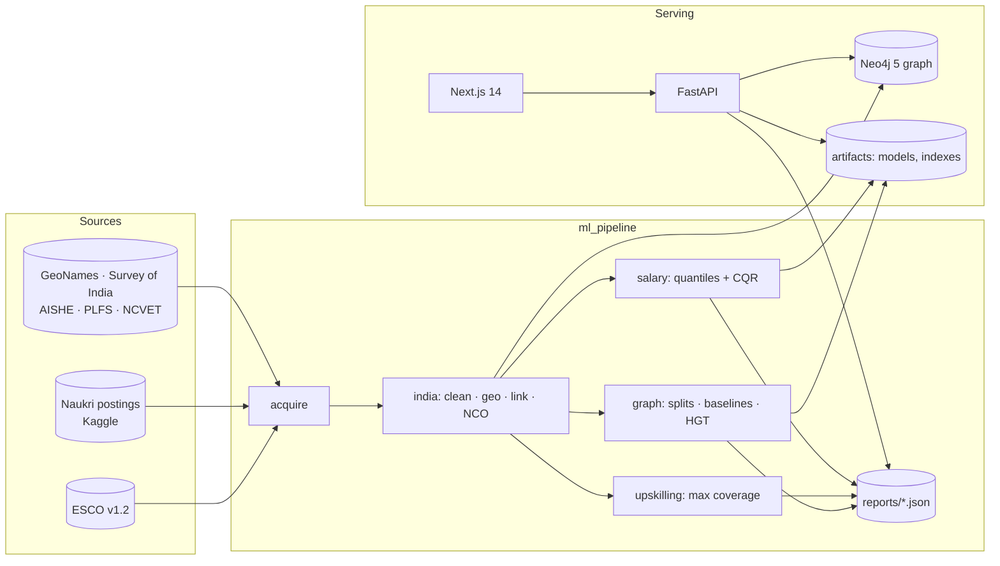

<div align="center">

# Yojak · योजक

**Skill, job and workforce intelligence for India**

*Built for **Build for Bharat 2.0**: Intelligent Talent and Workforce Ecosystem*

Yojak (Sanskrit/Hindi for *"the one who connects"*) links what people know to what Indian employers ask for, and tells each person the **smallest set of skills that opens the most jobs**.

[Problem](#the-problem) · [What Yojak does](#what-yojak-does) · [Judging chain](#how-the-project-maps-to-the-judging-chain) · [Results](#results) · [Methods](#methods) · [Run it](#run-it-locally) · [API](#api) · [Limitations](#limitations-and-honesty)

</div>

---

## The problem

India produces millions of graduates a year, and employers still report they can't find the skills they need. Four groups are working without shared, evidence-based information:

| Who | What they struggle with |
|---|---|
| **Students and job-seekers**, especially outside metros | Which roles fit my skills? What should I learn next, and which of those skills is actually worth the effort? What does this role pay in my city? |
| **Recruiters** | Matching a job description to candidates by the skills behind the words, not just the keywords, and seeing each candidate's gaps. |
| **Colleges and training providers** | Is our syllabus teaching what employers ask for today? Which high-demand skills are missing, and which taught skills have low current demand? |
| **Workforce planners** | Where is skill demand concentrated by state and city tier, and where does demand outpace the local supply of graduates? |

Job portals list postings, and taxonomies like ESCO list skills, but nothing connects Indian postings to a skills graph in a way these groups can act on.

## What Yojak does

Yojak builds a **knowledge graph of Indian job postings linked to the ESCO skills taxonomy**, learns from it, and serves four stakeholder views on top.

| View | You give | You get |
|---|---|---|
| **Student** (`/student`) | Skills typed in English, Hindi, Punjabi or romanised Hindi, or an uploaded resume. Optional city tier, state, experience. | Matching roles and live postings, each with a **"why" panel** showing the graph path and the skills that drove the match. The skill gap. An **optimal k-skill learning plan** compared with the usual "most common skills" advice, showing how many more jobs each step unlocks. A salary **range** (P10 to P90), never a single number. A Tier-2/3 filter. |
| **Recruiter** (`/recruiter`) | A pasted job description. | Extracted skills, which you can edit. Candidates ranked by fit, each with matched and missing skills and a "why" panel. Demo candidates are **clearly labelled synthetic**; real resumes can be uploaded and ranked alongside them. |
| **College / training provider** (`/institution`) | A syllabus (PDF or text). | The skills it teaches, its coverage of current demand for chosen roles and regions, the **missing high-demand skills**, and the taught skills with **low current demand**. Exportable as CSV. |
| **Workforce planner** (`/workforce`) | State, city tier, skill family. | An **India map** of skill demand, tier breakdowns, salary ranges by tier, and a **shortage index** (demand share ÷ graduate-supply share). The supply side is a clearly labelled coarse proxy from government data. |

An **Evidence page** (`/evidence`) walks judges through the whole chain from data to impact. Every number on it is read live from `reports/*.json`.

An **admin area** has system health, occupation notes and the gold-labelling tool the team uses to measure linking accuracy.

## How the project maps to the judging chain

| Link | What we did | Code | Evidence |
|---|---|---|---|
| **Problem identification** | Four stakeholders, and the decision each one needs to make | this README, `/` | |
| **Data acquisition** | About 97.9K Naukri postings (Kaggle), ESCO v1.2 (13.9K skills, 3K occupations), GeoNames, Survey-of-India boundaries, AISHE, PLFS, NCVET/NCO-2015 | `ml_pipeline/acquire.py`, `data/SOURCES.md` | `reports/data_quality.json` |
| **Data preparation** | Dedupe and near-duplicate grouping; salary rules; experience bands; multi-city parsing; city → state → HRA tier; skill-tag and job-title linking to ESCO; NCO-2015 family codes; a Neo4j load | `ml_pipeline/india/` | `reports/data_quality.json` |
| **Analytical approach** | Link prediction on a heterogeneous graph: four baselines against a Heterogeneous Graph Transformer, on leakage-safe splits, with ablations | `ml_pipeline/graph/` | `reports/model_comparison.json` |
| **Insights and predictions** | An optimal upskilling plan (weighted max coverage, lazy greedy compared with an exact ILP); salary quantiles with conformal intervals and a selection-bias test | `ml_pipeline/upskilling/`, `ml_pipeline/salary/` | `reports/upskilling_eval.json`, `reports/salary_eval.json` |
| **Solution** | FastAPI with four stakeholder views and "why" panels on every recommendation | `app/api/`, `app/frontend/` | `/evidence`, `scripts/demo.py` |
| **Real-world impact** | Extra eligible jobs for Tier-2/3 freshers from the optimal plan compared with frequency-based advice, with every assumption stated | `scripts/impact.py` | `reports/impact.json`, `reports/EVALUATION.md` |

## Results

> Every number in this section is **generated**, not typed. `scripts/render_readme.py` fills the block below from `reports/*.json`, and CI fails if the README no longer matches the reports. A report that hasn't been generated yet shows as *pending*, never as an estimate.

<!-- results:start -->

### Data (from `reports/data_quality.json`)

| | |
|---|---|
| Raw postings | 97,929 |
| After removing duplicate job IDs | 97,679 |
| Jobs with at least one skill tag | 97,108 |
| Non-remote jobs resolved to an Indian city | 99.7% (1,410 cities, 34 states/UTs) |
| Jobs by primary city tier (1 / 2 / 3) | 60,353 / 26,131 / 8,813 |
| Unique skill tags | 43,716 (754K mentions) |
| Tag mentions linked to an ESCO skill | 65.6% (provisional threshold; tuned once gold labels exist) |
| Jobs linked to an ESCO occupation | 77.1% (1,944 distinct occupations) |
| Postings that disclose salary | 33.9% (Tier 1: 26.9%, Tier 2: 43.8%, Tier 3: 50.6%) |
| Posting dates | real, from `jobId`; 86.9% agree with "N days ago"; inferred scrape date 2025-10-03 |
| Skill-linking precision (team-labelled gold) | *pending team labels* |

### Models (from `reports/model_comparison.json`)

*Pending:* T1 job-skill completion, T2 occupation-skill recovery and T3 candidate→job fit for B0 Popularity, B1 TF-IDF kNN, B2 SkillAlign (mpnet + FAISS), B3a Adamic-Adar, B3b LightGCN and the HGT. Each shows Recall@10, NDCG@10 and MRR with 95% CIs, p50/p95 latency and memory, plus the ablations and the shipped winner.

### Upskilling (from `reports/upskilling_eval.json`)

*Pending:* jobs unlocked by lazy greedy, plain greedy and top-k-by-frequency, compared with the exact optimum, for k ∈ {1, 3, 5} and τ ∈ {0.4, 0.6, 0.8}; the optimality gap (mean and p95); runtime.

### Salary (from `reports/salary_eval.json`)

*Pending:* MAE and MdAPE of P50, pinball loss, 80% interval coverage before and after conformal calibration, and the disclosure-bias verdict.

### Impact (from `reports/impact.json`)

*Pending:* extra eligible postings for Tier-2/3 freshers from a 3-skill optimal plan compared with frequency advice, with every assumption listed.

<!-- results:end -->

The full write-up (data, method, baselines, metrics, ablations, optimality gap, limitations) is generated at [`reports/EVALUATION.md`](reports/EVALUATION.md).

## Architecture



**The graph.** ESCO provides `Skill`, `Occupation`, `SkillGroup`, `OccupationGroup` and `ConceptScheme` nodes. The India layer adds `Job`, `Company`, `City`, `State`, `ExperienceBand` and `Tag`, connected by these edges:
- `(Job)-[:REQUIRES]->(Skill)`
- `(Job)-[:MAPS_TO]->(Occupation)`
- `(Company)-[:POSTS]->(Job)`
- `(Job)-[:LOCATED_IN]->(City)-[:IN_STATE]->(State)`
- `(Job)-[:NEEDS_EXP]->(ExperienceBand)`
- `(Job)-[:TAGGED]->(Tag)-[:SAME_AS]->(Skill)`

Unlinked tags stay in the graph rather than being thrown away. `Occupation.ncoFamily` carries the Indian NCO-2015 family code.

**Stack.**
- **Backend:** Python 3.11, FastAPI, Neo4j 5 Community (runs natively; no Docker), PyTorch, sentence-transformers (`all-mpnet-base-v2` and `paraphrase-multilingual-mpnet-base-v2`), FAISS, scikit-learn, LightGBM, OR-Tools.
- **Frontend:** Next.js 14, TypeScript, Tailwind, Radix/shadcn, React Query, Motion, visx, d3-geo and sigma.js.

## Methods

### 1. Data preparation (`ml_pipeline/india/`)

- **Cleaning.**
  - Duplicate `jobId`s are dropped.
  - Near-duplicates (same company, normalised title and tag set) share a `dup_group_id`, so a posting repeated across cities never lands on both sides of a train/test split.
  - Salary: zero means *not disclosed*, a missing min or max is filled from the other, min and max are swapped when reversed, and values outside ₹50K–₹5Cr a year are flagged implausible.
  - **USD-labelled salaries are excluded, not converted.** Every one is an Indian role quoting rupee figures, for example a Nagpur trainee at "10,000–15,000 USD PA". Converting them would invent salaries.
- **Posting dates.** Naukri job IDs begin with the posting date (DDMMYY). We *test* this rather than assume it: posting date + "N days ago" lands on one scrape date (2025-10-03) for 86.9% of rows, and volume dips on Sundays. The dates are real but span about two weeks, so Yojak makes **no forecasting or "emerging skill" claims**. The dates are used for a time-based robustness check and a with/without-time ablation.
- **Geography.**
  - Location strings are split into cities (`"Hybrid - Bengaluru"`, `"Hyderabad, Chennai, Bengaluru"`, `"Kolkata(Chinar Park)"`), plus a remote/hybrid work mode.
  - Cities are resolved against GeoNames through a curated alias table (Gurgaon→Gurugram, Vasai→Vasai-Virar), with conservative fuzzy matching.
  - **Tier = 7th CPC HRA class** (X→1, Y→2, else 3, per the Ministry of Finance order of 21 July 2015). A separate metro-region flag keeps NCR and MMR satellites together.
- **Linking free text to ESCO** (tags, titles, resumes, JDs, syllabi) uses one shared linker:
  - An exact match on ESCO preferred and alternative labels.
  - Otherwise, embedding top-k over about 100K ESCO labels with a cosine threshold.
  - Below the threshold, the tag goes to an *unlinked* table rather than being forced onto the taxonomy.
- **Job titles** are cleaned (seniority and level noise removed, acronyms like AI/ML and HR expanded). The candidates are then **re-ranked with the job's own linked skills**, but only among near-ties in title similarity; an exact title match is never overridden.
- **NCO-2015.** The ISCO-08 unit group becomes the NCO-2015 *Family* (4 digits), per NCVET (2023) §2.2.8. Armed forces are excluded (NCO has no division 0). The 8-digit occupation level is deliberately not attempted.
- **Gold evaluation.**
  - Stratified, frozen samples: 200 tags (score band × mention band) and 200 job titles.
  - Labelled by the team in `/admin/labelling`, with model suggestions shown.
  - Precision and recall are estimated with inverse-probability weights, using a **dev/test split**: the threshold is tuned on dev and reported on test, with bootstrap 95% CIs.
  - Reported as *team-labelled, model-assisted*.
- **Multilingual input.** Team-written Hindi, Punjabi and romanised-Hindi phrases for 60 common skills measure cross-lingual linking for both embedding models (`reports/multilingual_eval.json`). Non-English input always goes through the multilingual model.

### 2. Link prediction (`ml_pipeline/graph/`)

**Splits.** Jobs are split by near-duplicate group into train 70 / val 10 / test 10 / pool 10.
- **Known edges:** everything models may see.
- **Hidden edges:** the evaluation targets. These are half of each val/test job's skills and 20% of each ESCO occupation's skills.

Automated checks confirm that no hidden edge is visible to any model and no group spans two splits.

| Task | Question |
|---|---|
| **T1** job-skill completion | Given half of a posting's skills, which skills is it missing? |
| **T2** occupation-skill recovery | Given 80% of an ESCO occupation's skills, what's the rest? |
| **T3** candidate→job fit *(proxy)* | A pseudo-candidate (40–70% of a posting's skills plus 2 random skills) ranks about 9.5K pool jobs. The source job has grade 2 and jobs of the same occupation grade 1. **This is a proxy**: the data has no applications or hires. |

**Models.** All models are trained on the same known edges and scored on the same queries.
- **B0** popularity.
- **B1** TF-IDF item-kNN.
- **B2** SkillAlign's original method: mpnet + FAISS over ESCO occupations, rebuilt from known skills only so nothing leaks.
- **B3a** Adamic-Adar.
- **B3b** LightGCN.
- **M: a Heterogeneous Graph Transformer** reused from our Vyuha project.
  - Six node types: job, skill, occupation, company, city and experience band, with reverse relations.
  - Text-embedding node features.
  - A DistMult link head for (job, skill) and (occupation, skill).
  - A contrastive head for (candidate, job).
  - Inductive encoding for new candidates.
  - A temperature-calibrated edge probability.

**Protocol.**
- **Metrics:** Recall@10, NDCG@10 and MRR, with 95% bootstrap CIs, 3 seeds, and paired bootstrap tests against the best baseline.
- **Online cost:** p50/p95 latency and memory.
- **Model selection:** every tuning decision (thresholds, fold-in rules, hyperparameters) is made on validation data or a *train-job* T3 dev set. The test pool is used only once, for the final numbers.
- **Ablations:** raw tags instead of ESCO links; no company/city nodes; 1 vs 2 HGT layers; with vs without posting-time encoding.
- **Shipping rule:** the API ships **whichever model wins on T3**. If the HGT doesn't beat the baselines, the report and this README say so.

### 3. Optimal upskilling (`ml_pipeline/upskilling/`)

For a person with skills *S* and a target pool of jobs, pick *k* skills *A* to learn.

| | Definition |
|---|---|
| Fit of job *j* | `fit(S, j) = Σ w_s over R_j ∩ S / Σ w_s over R_j` (IDF-weighted share of the job's skills) |
| Eligible | `fit ≥ τ` |
| True objective | `F(A) = Σ_j v_j · 1[fit(S ∪ A, j) ≥ τ]`, with `v_j` = 1 or the job's median salary |
| Surrogate | `G(A) = Σ_j v_j · min(1, fit(S ∪ A, j) / τ)` |

- **F is not submodular.** Two skills can each unlock nothing alone and a job together; `docs/optimality.md` gives a counterexample.
- **G is monotone submodular** (a concave function of a modular one), so **lazy greedy** on G carries the (1 − 1/e) guarantee on G.
- **Exact optimum of F.** OR-Tools CP-SAT solves an ILP for F exactly, and brute force cross-checks it on small cases. We report the **real optimality gap** on F, not just a theoretical bound.
- **Baseline:** top-k skills by raw frequency, which is what most career tools do.
- **Effort-aware variant.** It maximises gain per unit effort under a budget, using cost-benefit greedy plus the best single skill. **The effort weight is a documented heuristic** (graph distance from what you know, skill type, breadth), not measured learning time, and users can override it.
- **Output per recommended skill:** the jobs it unlocks (listed, for the "why" panel), the salary shift *as a range*, and the effort weight with its breakdown.

### 4. Salary intelligence (`ml_pipeline/salary/`)

- Only about 34% of postings disclose pay, so LightGBM **quantile models (P10, P50, P90)** are trained on disclosed rows only. The target is the posted salary midpoint, not realised pay.
- **Conformalised quantile regression** on a calibration split targets 80% interval coverage.
- Reported per tier and experience band: MAE, MdAPE, pinball loss, and coverage before and after calibration.
- **Selection bias is tested, not assumed away.** We compare disclosed and undisclosed postings by occupation, state, tier and experience (χ², Cramér's V, standardised mean difference, KS), train a disclosure-propensity classifier (its AUC), and run an inverse-propensity-weighted sensitivity model. Disclosure already rises from 27% in Tier 1 to 51% in Tier 3.
- **A salary is never shown without its interval.** When fewer than N similar disclosed postings back an estimate, Yojak says so instead of guessing.

### 5. Workforce supply proxy

- **Shortage index:** demand share ÷ supply share, per skill family and state.
- **Supply:** AISHE graduate out-turn by discipline and state, and PLFS state labour force, mapped through `data/reference/discipline_to_skillfamily.csv`.
- It's shown everywhere as a **coarse proxy**, with its formula and sources.

## Honesty rules (enforced in code)

1. **No fabricated numbers.**
   - Every metric comes from a script that writes `reports/*.json` with provenance: git commit, input file hashes, seed, script and time.
   - The UI and this README only *read* those files.
   - CI checks that the README results block is up to date.
2. **Synthetic data is labelled everywhere.**
   - Demo candidates carry a required `synthetic: true` field in the API schema and in Neo4j, and the UI shows a badge.
   - They have IDs such as `SC-0421`, never invented human names.
3. **Salaries are always ranges:** `{p10, p50, p90, n_support}`. No API field carries a bare salary.
4. **Proxies are called proxies:** T3 fit, the supply side of the shortage index, the effort weight, and "low current demand" (not "outdated").
5. **When something can't be done honestly with this data, we say so and do the closest honest thing.** For example: USD salaries, forecasting, and NCO beyond 4 digits.

## Limitations and honesty

- **Representativeness.** Naukri postings are formal-sector, urban and white-collar. Tier-3 and informal work are under-represented, and results describe *posted* demand only.
- **Time.** Posting dates are real but cover about two weeks: no trends and no forecasts.
- **No outcome data.** There are no applications or hires, so candidate→job fit is evaluated with a stated proxy (T3), and eligibility is not a hiring prediction.
- **Salary.** Posted midpoints from the 34% of postings that disclose, with measured selection bias. They are not realised pay.
- **Taxonomy gap.** ESCO has no entries for many tools Indian employers ask for (React, Spring Boot, Kubernetes, AWS). These stay as tags and are reported as a gap.
- **Reference lists.** The HRA city-tier list and the alias table were transcribed by the team and should be re-checked against the official order.
- **Admin protection** is a demo-grade shared token, not user authentication.

## Run it locally

**Requirements:** Windows 10/11, Python 3.11, Node 18+, Java 17 (for Neo4j). A CUDA GPU is optional; it speeds up training. No Docker is needed.

```powershell
scripts/setup.ps1      # .venv, pip + npm installs, .env with a random Neo4j password, project-local Neo4j
```

**Data:**
1. Download **ESCO v1.2** (English, CSV, classification) from <https://esco.ec.europa.eu/en/use-esco/download> and unzip it into `data/raw/esco/`. The portal is form-gated.
2. Put your Kaggle API key in `~/.kaggle/kaggle.json`.
3. Fetch everything scriptable:

```powershell
scripts/run.ps1 data
```

**Build and run:**

```powershell
scripts/run.ps1 pipeline   # ESCO graph -> India layer -> models, indexes and reports
scripts/run.ps1 eval       # benchmarks, upskilling and salary evaluations -> reports/
scripts/run.ps1 up         # Neo4j + API (:8000) + web (http://localhost:3000)
scripts/run.ps1 demo       # 5-minute scripted demo: three personas, saved to reports/demo_output/
scripts/run.ps1 test       # pytest, ruff, tsc, eslint
scripts/run.ps1 stop
```

Individual stages:

```powershell
.venv\Scripts\python -m ml_pipeline.run_pipeline          # ESCO graph + FAISS index
.venv\Scripts\python -m ml_pipeline.india.run             # India data layer + data_quality.json
.venv\Scripts\python -m ml_pipeline.india.gold sample     # draw the frozen gold samples (once)
.venv\Scripts\python -m ml_pipeline.india.gold tune       # tune linking thresholds on gold dev labels
.venv\Scripts\python -m ml_pipeline.india.gold evaluate   # refresh gold precision in data_quality.json
.venv\Scripts\python -m ml_pipeline.india.multilingual    # multilingual_eval.json
.venv\Scripts\python -m ml_pipeline.graph.evaluate        # model_comparison.json
```

**Key environment variables** (`.env`, see `.env.example`): `NEO4J_URI`, `NEO4J_PASSWORD`, `ADMIN_TOKEN`, `MODEL_NAME`, `MULTILINGUAL_MODEL_NAME`, `CORS_ORIGINS`. The frontend reads `NEXT_PUBLIC_API_URL`.

## API

Interactive docs are at <http://127.0.0.1:8000/docs>.

| Area | Endpoints |
|---|---|
| Health and diagnostics | `GET /health` · `GET /admin/diagnostics/{nodes-by-label, rels-by-type, endpoints, metrics}` |
| Catalogue | `GET /catalog/{skills, occupations, occupation-groups, skill-groups, concept-schemes}` |
| Occupations and skills | `GET /occupations` · `GET /occupations/{uri}/skill-gap` · `GET /skills` |
| Extraction | `POST /extract/skills`: text, resume or syllabus → linked ESCO skills (any supported language) |
| Student | `POST /student/match` · `POST /student/plan` |
| Recruiter | `POST /recruiter/rank` |
| Institution | `POST /institution/coverage` |
| Workforce | `GET /workforce/demand` · `GET /workforce/shortage` |
| Salary | `GET /salary/estimate`, which always returns P10/P50/P90 plus support |
| Evidence | `GET /reports/{name}` |
| Admin | `/notes/admin/...` · `/admin/labelling/...` (writes need `X-Admin-Token`) |
| Legacy (SkillAlign) | `POST /recommendations` |

Every recommendation response carries a `why` object:
- **Roles and jobs:** the graph path from your skill to the linked ESCO skill, to the job or occupation.
- **Model scores:** occlusion attributions.
- **Plan skills:** the jobs each one unlocks.
- **Shortage cells:** the underlying counts and sources.

## Testing

- `pytest`: unit and API tests against a scripted fake Neo4j, so no database is needed.
- `pytest -m neo4j`: integration tests against a **disposable** Neo4j (`NEO4J_TEST_URI`, `NEO4J_TEST_PASSWORD`). They refuse to wipe any database they didn't create.
- **CI** (`.github/workflows/ci.yml`):
  - ruff and pytest.
  - Integration tests on a Neo4j tarball (no containers).
  - Frontend typecheck, lint and build.
  - A README-freshness check.
- Regression tests cover every bug found in the [Phase 0 audit](reports/phase0_audit.md) of the inherited code, plus leakage checks on every data split.

## Repository layout

```
app/
  api/            FastAPI: routes -> services -> repos -> schemas
  core/           settings, Neo4j client, ML engine, linker, admin guard, latency metrics
  frontend/       Next.js 14 app: landing, student, recruiter, institution, workforce, evidence, admin
ml_pipeline/
  acquire.py      fetch all scriptable data sources
  run_pipeline.py ESCO graph + FAISS index (from SkillAlign, fixed)
  india/          Naukri cleaning, geography/tiers, ESCO linking, NCO-2015, gold evaluation, Neo4j load
  graph/          splits, metrics, baselines, LightGCN, hgt/ (from Vyuha), evaluation
  upskilling/     max-coverage objectives, lazy greedy, ILP, effort-aware variant
  salary/         quantile models, conformal calibration, selection-bias analysis
  synthetic/      labelled synthetic candidate pool for the recruiter demo
  supply/         AISHE / PLFS supply proxy
data/
  SOURCES.md      every external file: URL, date, licence, hash
  reference/      hand-curated tables (city tiers, aliases, discipline map), each citing its source
  gold/           frozen evaluation samples and team labels
reports/          generated JSON reports, EVALUATION.md, phase0_audit.md
scripts/          setup / neo4j / run (PowerShell + bash), demo, impact, render_readme
tests/            pytest suite and fixtures (ESCO mini-slice)
```

## Data and licences

| Data | Licence | Notes |
|---|---|---|
| ESCO v1.2 | CC BY 4.0 | "This service uses the ESCO classification of the European Commission." |
| Indian Job Market Dataset 2025 (Naukri, Kaggle) | CC BY-NC-SA 4.0 | Not redistributed. Derived outputs are non-commercial and share-alike. |
| GeoNames | CC BY 4.0 | |
| Survey of India boundaries via DataMeet | DataMeet repository terms | Boundaries follow the official claims. |
| AISHE, PLFS, NCVET / NCO-2015 | Government of India publications | |

Full attributions are in [NOTICE](NOTICE), and URLs, dates and hashes in [data/SOURCES.md](data/SOURCES.md).

## Credits

- **SkillAlign** by Yasser Khattach (MIT). Yojak is a fork: the FastAPI layout, ESCO ETL and the original recommender came from there, and were audited and fixed.
- **Vyuha**, our team's project. The Heterogeneous Graph Transformer layer and temporal encoder are reused verbatim, and the training loop and graph validation are adapted.
- Everything else is new in Yojak. [CREDITS.md](CREDITS.md) lists exactly which files came from where.

## Licence

Code: MIT (see [LICENSE](LICENSE)). Data: see the table above.
